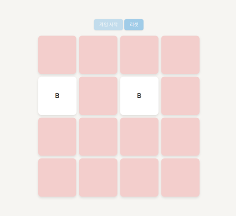

# memory-match-game
A simple memory match game from GitHub Pages.  

Game Rules: When you press the start game button, all cards will be shown for 2 seconds.  
You can flip over the cards with the same alphabet in order by clicking them.  
You win the game when you flip over all the cards. You can check the time it took to clear.  

